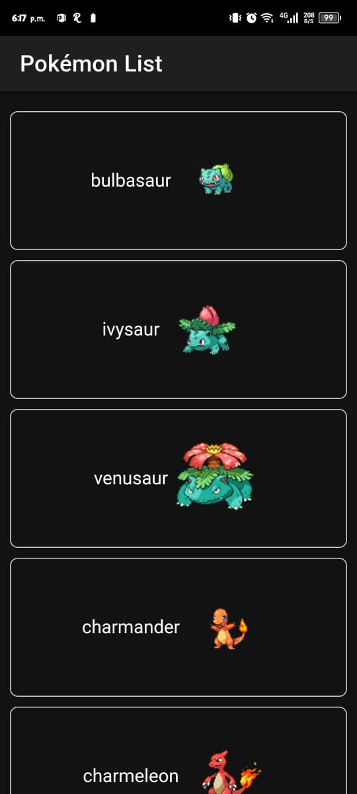
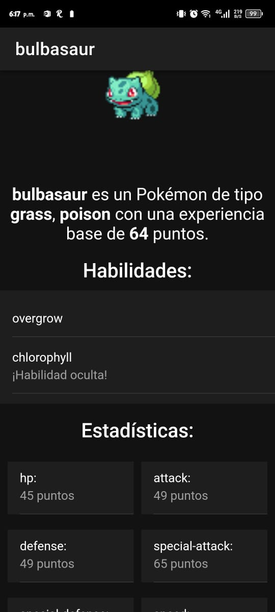

# Pokedex con Ionic 🔥 💧 🍃 ⚡

Esta aplicación móvil está desarrollada con **Ionic** y **Capacitor**, e integra la [API de Pokémon](https://pokeapi.co/) para mostrar una lista interactiva de Pokémon con información detallada sobre cada uno.

## 🚀 Características

- Listado de Pokémon obtenido dinámicamente desde la [API de Pokémon](https://pokeapi.co/).
- Información detallada de cada Pokémon, como habilidades, estadísticas y tipos.
- Interfaz amigable y adaptativa (responsive).
- Uso de modales para presentar datos adicionales de cada Pokémon.
- Compatible con dispositivos Android.

## 📸 Capturas de Pantalla

A continuación, se presentan algunas capturas de pantalla de la aplicación para ilustrar sus funcionalidades y diseño:

### Pantalla Principal

> **Descripción**: La pantalla principal muestra una lista interactiva de Pokémon con imágenes y nombres.


### Modal de Detalles del Pokémon

> **Descripción**: Al seleccionar un Pokémon, se abre un modal con detalles como sus estadísticas, tipos y habilidades.


## 📖 Estructura del Código y Explicaciones

### **1. Servicio para consumir la API**
Se utiliza un servicio `PokemonService` para gestionar las peticiones HTTP.  
**Archivo:** `src/app/services/pokemon.service.ts`

```typescript
import { Injectable } from '@angular/core';
import { HttpClient } from '@angular/common/http';
import { Observable } from 'rxjs';

@Injectable({
  providedIn: 'root',
})
export class PokemonService {
  private apiUrl = 'https://pokeapi.co/api/v2';

  constructor(private http: HttpClient) {}

  // Obtener lista de Pokémon
  getPokemons(limit: number = 5, offset: number = 0): Observable<any> {
    return this.http.get(`${this.apiUrl}/pokemon?limit=${limit}&offset=${offset}`);
  }

  // Obtener detalles de un Pokémon por nombre o ID
  getPokemonDetails(nameOrId: string): Observable<any> {
    return this.http.get(`${this.apiUrl}/pokemon/${nameOrId}`);
  }
}
```

#### Puntos Clave:

- `getPokemons`: Obtiene un listado de Pokémon con un límite y un desplazamiento (offset).
- `getPokemonDetails`: Obtiene detalles específicos de un Pokémon usando su nombre o ID.

### **2. Página para listar Pokémon**

**Archivo:** `src/app/pages/pokemon-list.page.ts`

```typescript
import { Component, OnInit } from '@angular/core';
import { PokemonService } from 'src/app/services/pokemon.service';

@Component({
  selector: 'app-pokemon-list',
  templateUrl: './pokemon-list.page.html',
  styleUrls: ['./pokemon-list.page.scss'],
})
export class PokemonListPage implements OnInit {
  pokemons: any[] = [];
  loading = false;
  isModalOpen = false;
  selectedPokemon: any = null;

  constructor(private pokemonService: PokemonService) {}

  ngOnInit() {
    this.fetchPokemons();
  }

  fetchPokemons() {
    this.loading = true;
    this.pokemonService.getPokemons(50).subscribe({
      next: (response) => {
        this.pokemons = response.results.map((pokemon: any) => {
          // Agregamos imágenes de cada Pokémon
          this.pokemonService.getPokemonDetails(pokemon.name).subscribe({
            next: (details) => {
              pokemon.image = details.sprites.front_default;
            },
            error: (error) => console.error('Error:', error),
          });
          return pokemon;
        });
        this.loading = false;
      },
      error: (error) => {
        console.error('Error:', error);
        this.loading = false;
      },
    });
  }

  openModal(name: string) {
    this.loading = true;
    this.pokemonService.getPokemonDetails(name).subscribe({
      next: (response) => {
        this.loading = false;
        this.selectedPokemon = response;
        this.isModalOpen = true;
      },
      error: (error) => {
        console.error('Error:', error);
        this.loading = false;
      },
    });
  }

  closeModal() {
    this.isModalOpen = false;
    this.selectedPokemon = null;
  }
}
```

#### Puntos Clave:

- `fetchPokemons`: Obtiene un listado de Pokémon y agrega imágenes a cada uno.
- `openModal`: Abre un modal con detalles específicos de un Pokémon.

### **3. Plantilla HTML**

**Archivo:** `src/app/pages/pokemon-list.page.html`

```html
<ion-header>
  <ion-toolbar>
    <ion-title>Pokémon List</ion-title>
  </ion-toolbar>
</ion-header>

<ion-content>
  <ion-grid>
    <ion-row>
      <ion-col *ngFor="let pokemon of pokemons" (click)="openModal(pokemon.name)">
        <div class="pokemon-card">
          {{ pokemon.name }}
          
        </div>
      </ion-col>
    </ion-row>
  </ion-grid>

  <ion-spinner *ngIf="loading"></ion-spinner>

  <ion-modal [isOpen]="isModalOpen" (didDismiss)="closeModal()">
    <ng-template>
      <ion-header>
        <ion-toolbar>
          <ion-title>{{ selectedPokemon?.name }}</ion-title>
        </ion-toolbar>
      </ion-header>
      <ion-content>
        
        <p>
          <strong>{{ selectedPokemon?.name }}</strong> es de tipo 
          <span *ngFor="let type of selectedPokemon?.types">{{ type.type.name }}</span>.
        </p>
      </ion-content>
    </ng-template>
  </ion-modal>
</ion-content>
```

#### Puntos Clave:

- **Listas:** Se utiliza `*ngFor` para recorrer la lista de Pokémon y mostrarlos en tarjetas.
- **Modal:** Se utiliza un modal de Ionic para mostrar detalles de un Pokémon al hacer clic en su tarjeta.

## 📦 Generar APK de Android

1. Añadir la plataforma Android:

```bash
npx cap add android
```

2. Compilar el proyecto:

```bash
ionic build
npx cap copy
npx cap sync
```

3. Abrir Android Studio y ejecutar la aplicación en un emulador o dispositivo físico.

```bash
npx cap open android
```

4. Compilar y generar el APK desde Android Studio:

- **Build** -> **Build Bundle(s) / APK(s)** -> **Build APK(s)**

- Ubicación del APK: `android/app/build/outputs/apk/debug/app-debug.apk`
